# Cortex - Intelligent MCP Agent Orchestrator

Cortex is an intelligent agent orchestrator that manages multiple MCP (Model Context Protocol) servers for users.

It combines LiteLLM for natural language understanding with user-configured MCP servers to provide a powerful, multi-tenant agent platform.

```mermaid
graph TB
    subgraph "CHAINLIT"
        UI[Chat Interface]
        AUTH[User Authentication]
        SESSION[Session Management]
        MSGFORWARD[Message Forwarding]
    end

    subgraph "CORTEX"
        API[REST API Endpoints]
        QUEUE[Message Queue Handler]
        AGENT[Agent Orchestrator]
        REASONING[Reasoning Engine]
        WORKFLOW[Workflow Manager]
        MCPROUTER[MCP Request Router]
    end

    subgraph "📨 MESSAGE INFRA"
        REDIS[Redis/RabbitMQ]
        MSGQUEUE[(Message Queue)]
    end

    subgraph "🔧 MCP CLUSTER"
        GITHUB[GitHub MCP Server]
        SLACK[Slack MCP Server]
        NOTION[Notion MCP Server]
        CUSTOM[Custom MCP Servers]
    end

    subgraph "🗄️ SHARED DATA LAYER"
        POSTGRES[(PostgreSQL)]
    end

    %% Connections
    UI --> AUTH
    AUTH --> SESSION
    SESSION --> MSGFORWARD
    MSGFORWARD --> QUEUE
    MSGFORWARD --> API

    API --> AGENT
    QUEUE --> AGENT
    AGENT --> REASONING
    AGENT --> WORKFLOW
    WORKFLOW --> MCPROUTER
    MCPROUTER --> MSGQUEUE

    MSGQUEUE --> GITHUB
    MSGQUEUE --> SLACK
    MSGQUEUE --> NOTION
    MSGQUEUE --> CUSTOM

    AGENT --> POSTGRES
```

## Features

**Intelligent Message Processing** - Uses LiteLLM to understand natural language and route to appropriate MCP servers

**Multi-Tenant** - Each user can configure their own MCP servers with encrypted credentials

**Secure** - Credentials are encrypted and user-isolated

**Extensible** - Easy to add new MCP server types

**Conversational** - Maintains conversation context and history

**Smart Routing** - Automatically selects the right server and tool for each request

## Deployment

The idea of this project is to be able to scale the API independently of the MCP servers.

### Running REST API
A simple docker command will have you up and running

`docker compose up -d db cortex-api`

### Running a MCP server

The same goes for any MCP server you may have configured

`docker compose up -d github-mcp-1`

and of course you can scale them `--scale github-mcp-1=$SCALE_COUNT`